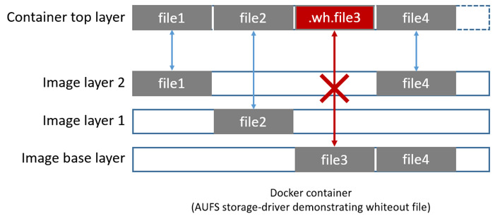

# Entendendo armazenamento no Docker

Para entender como o docker gerencia seus volumes, primeiro precisamos explicar como funciona ao menos um [backend](http://searchdatacenter.techtarget.com/definition/back-end) de armazenamento do Docker. Faremos aqui com o AUFS, que foi o primeiro e ainda é padrão em boa parte das instalações do Docker.


### Como funciona um backend do Docker (Ex.: AUFS)

Backend de armazenamento é a parte da solução do Docker que cuida do gerenciamento dos dados. No Docker temos várias possibilidades de backend de armazenamento, mas nesse texto falaremos apenas do que implementa o AUFS.

[AUFS](https://en.wikipedia.org/wiki/Aufs) é um unification filesystem. É responsável por gerenciar múltiplos diretórios, empilhá-los uns sobre os outros e fornecer uma única e unificada visão, como se todos juntos fossem apenas um diretório.

Esse único diretório é utilizado para apresentar o container e funciona como se fosse um único sistema de arquivos comum. Cada diretório usado na pilha corresponde a uma camada. E, é dessa forma que o Docker as unifica e proporciona a reutilização entre containeres. Pois, o mesmo diretório correspondente à imagem pode ser montado em várias pilhas de vários containeres.

Com exceção da pasta (camada) correspondente ao container, todas as outras são montadas com permissão de somente leitura, caso contrário as mudanças de um container poderiam interferir em outro. O que, de fato, é totalmente contra os princípios do Linux Container.

Caso seja necessário modificar um arquivo nas camadas (pastas) referentes às imagens, se utiliza a tecnologia [Copy-on-write](https://en.wikipedia.org/wiki/Copy-on-write) (CoW), responsável por copiar o arquivo para a pasta (camada) do container e fazer todas as modificações nesse nível. Dessa forma, o arquivo original da camada inferior é sobreposto nessa pilha, ou seja, o container em questão sempre verá apenas os arquivos das camadas mais altas.



No caso da remoção, o arquivo da camada superior é marcado como whiteout file, viabilizando a visualização do arquivo de camadas inferiores.

### Problema com performance

O Docker tira proveito da tecnologia Copy-on-write (CoW) do AUFS para permitir o compartilhamento de imagem e minimizar o uso de espaço em disco. AUFS funciona no nível de arquivo. Isto significa que todas as operações AUFS CoW copiarão arquivos inteiros, mesmo que, apenas pequena parte do arquivo esteja sendo modificada. Esse comportamento pode ter impacto notável no desempenho do container, especialmente se os arquivos copiados são grandes e estão localizados abaixo de várias camadas de imagens. Nesse caso o procedimento copy-on-write dedicará muito tempo para uma cópia interna.

### Volume como solução para performance

Ao utilizar volumes, o Docker monta essa pasta (camada) no nível imediatamente inferior ao do container, o que permite o acesso rápido de todo dado armazenado nessa camada (pasta), resolvendo o problema de performance.

O volume também resolve questões de persistência de dados, pois as informações armazenadas na camada (pasta) do container são perdidas ao remover o container, ou seja, ao utilizar volumes temos maior garantia no armazenamento desses dados.

### Usando volumes

#### Mapeamento de pasta específica do host


Nesse modelo o usuário escolhe uma pasta específica do host (Ex.: /var/lib/container1) e a mapeia em uma pasta interna do container (Ex.: /var). O que é escrito na pasta /var do container é escrito também na pasta /var/lib/container1 do host.

Segue o exemplo de comando usado para esse modelo de mapeamento:

```
docker run -v /var/lib/container1:/var ubuntu
```

Esse modelo não é portável. Necessita que o host tenha uma pasta específica para que o container funcione adequadamente.

#### Mapeamento via container de dados

Nesse modelo é criado um container e, dentro desse, é nomeado um volume a ser consumido por outros containeres. Dessa forma não é preciso criar uma pasta específica no host para persistir dados. Essa pasta é criada automaticamente dentro da pasta raiz do Docker daemon. Porém, você não precisa se preocupar com essa pasta, pois toda a referência será feita para o container detentor do volume e não para a pasta.

Segue um exemplo de uso do modelo de mapeamento:

```
docker create -v /dbdata --name dbdata postgres /bin/true
```
No comando acima, criamos um container de dados, onde a pasta /dbdata pode ser consumida por outros containeres, ou seja, o conteúdo da pasta /dbtada poderá ser visualizado e/ou editado por outros containeres.

Para consumir esse volume do container basta utilizar o comando:

```
docker run -d --volumes-from dbdata --name db2 postgres
```
Agora o container db2 tem uma pasta /dbdata que é a mesma do container dbdata, tornando esse modelo completamente portável.

Uma desvantagem é a necessidade de manter um container apenas para isso, pois em alguns ambientes os containeres são removidos com certa regularidade e, dessa forma, é necessário ter cuidado com containeres especiais. O que, de certa forma, é um problema adicional de gerenciamento.

#### Mapeamento de volumes

Na versão 1.9 do Docker foi acrescentada a possibilidade de criar volumes isolados de containeres. Agora é possível criar um volume portável, sem a necessidade de associá-lo a um container especial.

Segue um exemplo de uso do modelo de mapeamento:

```
docker volume create --name dbdata
```
No comando acima, o docker criou um volume que pode ser consumido por qualquer container.

A associação do volume ao container acontece de forma parecida à praticada no mapeamento de pasta do host, pois nesse caso você precisa associar o volume a uma pasta dentro do container, como podemos ver abaixo:

```
docker run -d -v dbdata:/var/lib/data postgres
```
Esse modelo é o mais indicado desde o lançamento, pois proporciona portabilidade. Não é removido facilmente quando o container é deletado e ainda é bastante fácil de gerenciar.


