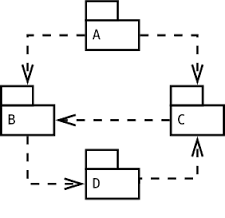

# Dependência

Seguindo a lista do modelo [12factor](http://12factor.net/), logo após o base de código que tratamos nesse [artigo](http://techfree.com.br/2016/06/dockerizando-aplicacoes-base-de-codigo/), agora temos **“Dependência”** como segunda boa prática.



Essa boa prática sugere a declaração de todas as dependências necessárias para executar seu código, ou seja, você nunca deve assumir que algum componente já estará previamente instalado no ativo responsável por hospedar essa aplicação.

Para viabilizar o “sonho” da portabilidade, precisamos gerenciar corretamente as dependências da aplicação em questão, isso indica que devemos também evitar a necessidade de trabalho manual na preparação da infraestrutura que suportará sua aplicação.

Automatizar o processo de instalação de dependência é o grande segredo de sucesso para atender essa boa prática, pois caso a instalação da sua infraestrutura não seja automática o suficiente para viabilizar a inicialização sem erros, o atendimento dessa boa prática estará prejudicada.

Automatizar esses procedimentos colabora com a manutenção da integridade do seu processo, pois o nome dos pacotes de dependências e suas respectivas versões estariam especificadas explicitamente em um arquivo localizado no mesmo repositório que o código, que por sua vez seria rastreado em um sistema de controle de versão. Com isso podemos concluir que nada seria modificado sem que se tenha o devido registro.

O Docker se encaixa perfeitamente nessa boa prática, pois é possível entregar um perfil mínimo de infraestrutura para essa aplicação, que por sua vez se fará necessária a declaração explícita de suas dependências para que a aplicação funcione nesse ambiente.

A aplicação que usamos como exemplo foi escrita em Python. Como podem ver na parte do código abaixo ela necessita de duas bibliotecas para funcionar corretamente:

```
from flask import Flask
from redis import Redis
```

Essas duas dependências estão especificados no arquivo requirements.txt e esse arquivo será usado como um parâmetro do pip.

“O PIP é um sistema de gerenciamento de pacotes usado para instalar e gerenciar pacotes de software escritos na linguagem de programação Python”. (Wikipedia)

O comando pip é usado, juntamente com o arquivo requirements.txt, na criação da imagem como foi demonstrado no Dockerfile da boa prática anterior (codebase):

```
FROM python:2.7
ADD requirements.txt requirements.txt
RUN pip install -r requirements.txt
ADD . /code
WORKDIR /code
CMD python app.py
```

Perceba que um dos passos do Dockerfile é instalar as dependências explicitamente descritas no arquivo requirements.txt com o gerenciador de pacotes pip do Python. Veja o conteúdo do arquivo requirements.txt:

```
flask==0.11.1
redis==2.10.5
```

É importante salientar a necessidade de se especificar as versões de cada dependência, pois como no modelo de contêiner as suas imagens podem ser construídas a qualquer momento, é importante saber qual versão específica a sua aplicação precisa, caso contrário poderemos encontrar problemas com compatibilidade caso uma das dependências atualize e não esteja mais compatível com a composição completa das outras dependências e a aplicação que a está utilizando.

Para acessar o código descrito aqui, baixe o [repositório](https://github.com/gomex/exemplo-12factor-docker) e acesse a pasta **“factor2“**.

Um outro resultado positivo do uso dessa boa prática é a simplificação da utilização do código por outro desenvolvedor. Um novo programador pode verificar nos arquivos de dependências quais os pré-requisitos para sua aplicação executar, assim como executar facilmente o ambiente sem a necessidade de seguir uma extensa documentação que raramente é atualizada.

Usando o Docker é possível configurar automaticamente o necessário para rodar o código da aplicação, seguindo com isso essa boa prática perfeitamente.