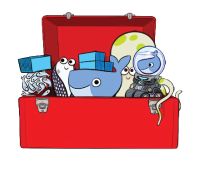
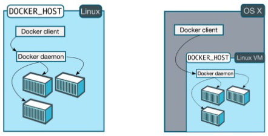

# Como usar Docker sem GNU/Linux

Esse artigo tem como objetivo explicar de forma detalhada, e com exemplos, o uso de Docker em estações MacOS e Windows.



Esse texto é para pessoas que já sabem sobre Docker, mas ainda não sabem como o Docker pode ser utilizado a partir de uma estação “não linux”.

Como já dissemos, o Docker utiliza recursos específicos do kernel hospedeiro e o GNU/Linux é o único sistema operacional que o suporta de forma estável. Significa que não é possível iniciar containers Docker em estação MacOS e Windows, por exemplo.

Mas não se preocupe, caso você não utilize GNU/Linux como sistema operacional, ainda é possível fazer uso dessa tecnologia, sem, necessariamente, executá-la em seu computador.

Um dos produtos da suíte Docker é o [Docker Toolbox](https://www.docker.com/products/docker-toolbox). Essa solução, é na verdade, uma abstração para instalação de todo ambiente necessário para uso do Docker a partir de uma estação MacOS ou Windows.

A instalação é simples: tanto no Windows, como no MacOS, basta baixar o instalador correspondente nesse [site](https://www.docker.com/products/docker-toolbox) e executá-lo seguindo os passos descritos nas telas.

Os softwares instalados na estação - MacOS ou Windows - a partir do pacote Docker Toolbox são:

* [Virtualbox](https://www.virtualbox.org/)
* [Docker machine](https://docs.docker.com/machine/overview/)
* [Docker client](https://docs.docker.com/)
* [Docker compose](https://docs.docker.com/compose/overview/)
* [Kitematic](https://docs.docker.com/kitematic/userguide/)

Docker Machine é a ferramenta que possibilita criar e manter ambientes Docker em máquinas virtuais, ambientes de nuvem e, até mesmo, em máquina física. Mas nesse tópico, abordaremos apenas máquina virtual com virtualbox.

Após instalar o Docker Toolbox é muito simples criar um ambiente Docker com máquina virtual usando o Docker Machine.

Primeiro verificamos se não existem máquinas virtuais com Docker instaladas em seu ambiente:

```
docker-machine ls
```
O comando acima mostra apenas ambientes criados e mantidos por seu Docker Machine. É possível que, após instalar o Docker Toolbox, você não encontre máquina alguma criada. Nesses casos, utilizamos o comando abaixo para criar a máquina:

```
docker-machine create --driver virtualbox default
```



O comando cria um ambiente denominado “default”. Na verdade é uma máquina virtual (“Linux VM” que aparece na imagem) criada no virtualbox. Com o comando abaixo é possível visualizar a máquina criada:

```
docker-machine ls
```

O retorno deve ser algo parecido com isto:


Uma máquina virtual foi criada, dentro dela temos um sistema operacional GNU/Linux com Docker Host instalado. Esse serviço Docker está escutando na porta TCP 2376 do endereço 192.168.99.100. Essa interface utiliza uma rede específica entre seu computador e as máquinas do virtualbox.

Para desligar a máquina virtual, basta executar o comando abaixo:

```
docker-machine stop default
```
Para iniciar, novamente, a máquina, basta executar o comando:

```
docker-machine start default
```
O comando “start” é responsável apenas por iniciar a máquina. É necessário fazer com que os aplicativos de controle do Docker, instalados na estação, possam se conectar à máquina virtual criada no virtualbox com o comando “docker-machine create”.

Os aplicativos de controle (Docker e Docker-compose) fazem uso de variáveis de ambiente para configurar qual Docker Host será utilizado. O comando abaixo facilita o trabalho de aplicar todas as variáveis corretamente:

```
docker-machine env default
```

O resultado desse comando no MacOS é:


Como vemos, informa o que pode ser feito para configurar todas as variáveis. Você pode copiar as quatros primeiras linhas, que começam com “export”, e colar no terminal ou, pegar apenas a última linha sem o “#” do início e executar na linha de comando:

```
eval $(docker-machine env default)
```

Agora os aplicativos de controle (Docker e Docker-Compose) estão aptos a utilizar o Docker Host a partir da conexão feita no serviço do IP 192.168.99.100 - máquina criada com o comando “docker-machine create” mencionados anteriormente.

Para testar, listamos os containers em execução nesse Docker Host com o comando:

```
docker ps
```
Executado na linha de comando do MacOS ou Windows, esse cliente do Docker se conecta à máquina virtual que, aqui chamamos de “Linux VM”, e solicita a lista de containers em execução no Docker Host remoto.

Iniciamos um container com o comando abaixo:

```
docker container run -itd alpine sh
```
Agora, verificamos novamente, a lista de containers em execução:

```
docker ps
```
Podemos ver que o container criado a partir da imagem “alpine” está em execução. Vale salientar que esse processo é executado no Docker Host, na máquina criada dentro do virtualbox que, nesse exemplo, tem o ip 192.168.99.100.

Para verificar o endereço IP da máquina, basta executar o comando abaixo:

```
docker-machine ip
```
Caso o container exponha alguma porta para o Docker Host, seja via parâmetro “-p” do comando “docker container run -p porta_host:porta_container” ou via parâmetro “ports” do docker-compose.yml, vale lembrar que o IP para acessar o serviço exposto é o endereço IP do Docker Host que, no exemplo, é “192.168.99.100”.

Nesse momento, você deve estar se perguntando: como é possível mapear uma pasta da estação “não-linux” para dentro de um container? Aqui entra um novo artíficio do Docker para contornar esse problema.

Toda máquina criada com o driver “virtualbox”, automaticamente, cria um mapeamento do tipo  “pastas compartilhadas do virtualbox” da pasta de usuários para a raiz do Docker Host.

Para visualizar esse mapeamento, acessamos a máquina virtual que acabamos de criar nos passos anteriores:

```
docker-machine ssh default
```
No console da máquina GNU/Linux digite os seguintes comandos:

```
sudo su
mount | grep vboxsf
```

O [vboxsf](https://help.ubuntu.com/community/VirtualBox/SharedFolders) é um sistema de arquivo usado pelo virtualbox para montar volumes compartilhados da estação usada para instalar o virtualbox. Ou seja, utilizando o recurso de pasta compartilhada, é possível montar a pasta /Users do MacOS na pasta /Users da máquina virtual do Docker Host.

Todo conteúdo existente na pasta /Users/SeuUsuario do MacOS, será acessível na pasta /Users/SeuUsuario da máquina GNU/Linux que atua como Docker Host no exemplo apresentado. Caso efetue a montagem da pasta /Users/SeuUsuario/MeuCodigo para dentro do container, o dado a ser montado é o mesmo da estação e nada precisa ser feito para replicar esse código para dentro do Docker Host.

Vamos testar. Crie um arquivo dentro da pasta de usuário:

```
touch teste
```
Iniciamos um container e mapeamos a pasta atual dentro dele:

```
docker container run -itd -v "$PWD:/tmp" --name teste alpine sh
```
No comando acima, iniciamos um container que será nomeado como “teste” e terá mapeado a pasta atual (a variável PWD indica o endereço atual no MacOS) na pasta /tmp, dentro do container.

Verificamos se o arquivo que acabamos de criar está dentro do container:

```
docker container exec teste ls /tmp/teste
```
A linha acima executou o comando “ls /tmp/teste” dentro do container nomeado “teste”, criado no passo anterior.

Agora acesse o Docker Host com o comando abaixo, e verifique se o arquivo teste se encontra na pasta de usuário:

```
docker-machine ssh default
```
**Tudo pode ser feito automaticamente? Claro que sim!**

Agora que já sabe como fazer manualmente, se precisar instalar o Docker Toolbox em uma máquina nova e não lembrar os comandos para criar a nova máquina ou, simplesmente como aprontar o ambiente para uso, basta executar o programa “Docker Quickstart Terminal”. Ele fará o trabalho automaticamente. Caso não exista máquina criada, ele cria uma chamada “default”. Caso a máquina já tenha sido criada, automaticamente configura suas variáveis de ambiente e deixa apto para utilizar o Docker Host remoto a partir dos aplicativos de controle (Docker e Docker-Compose).
